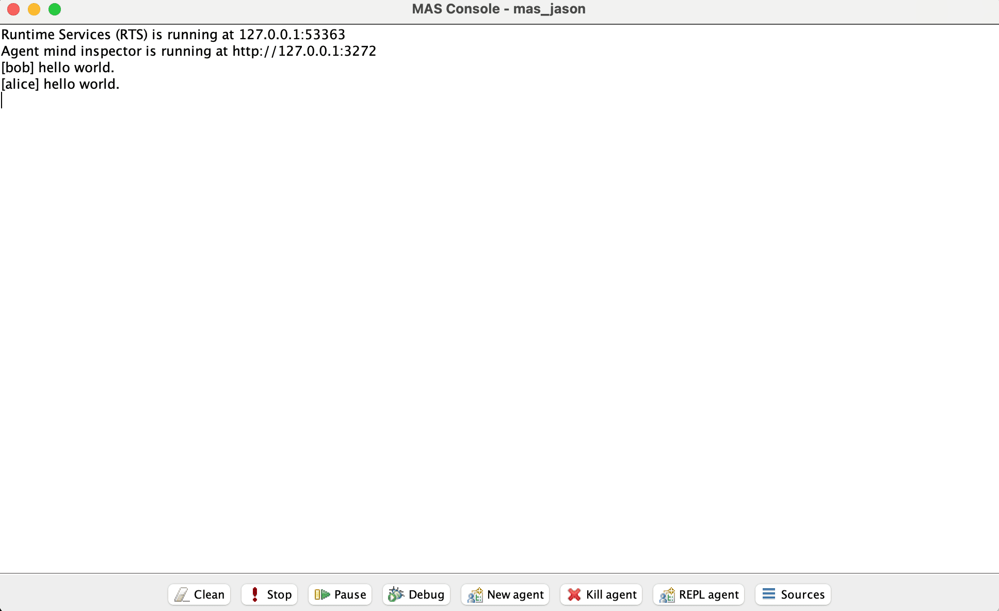

# Multi-Agent System Implementation using JASON interpreter

First approach to creating multi-agent systems using a DSL and open source JASON language. 

## Run Project

Build and download dependencies using gradle with the command.

`jason mas_jason.mas2j`

//TODO: there is a bug running directly this command and fails, temporal after the building and packaging face, you need to run gradle command run.

`gradle run`

This will open a Java Runtime with the Jason application execution.

## Dependencies
### MacOs 

- Homebrew: `/bin/bash -c "$(curl -fsSL https://raw.githubusercontent.com/Homebrew/install/HEAD/install.sh)"`
- Java 21: `brew install openjdk@21`
- Gradle: `brew install gradle`
- Jason interpreter:  `/opt/jason-3-2/bin/jason`

Press the button Stop to exit the app. 
----------

### References 
JASON interpreter - [Link]([https://](https://jason-lang.github.io/))

Homebrew - [Link]([https://](https://brew.sh/))

OpenJDK Formulae - [Link]([https://](https://formulae.brew.sh/formula/openjdk))